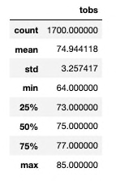
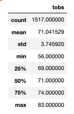
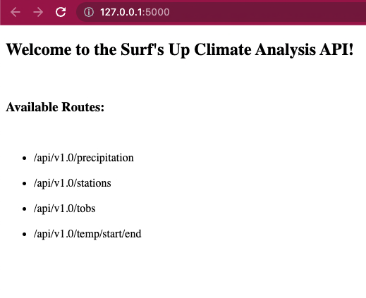
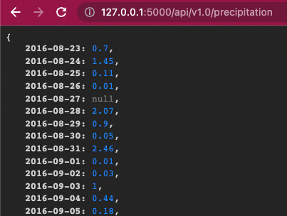
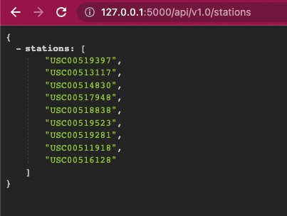
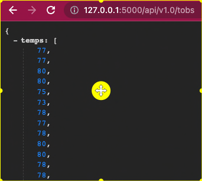
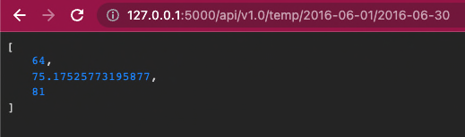
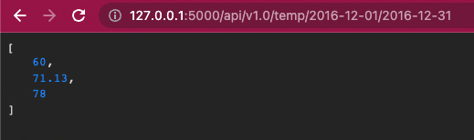

# Surf's Up!

## Overview

In the Climate Analysis completed previously, we determined that Oahu would be a good location for W. Avy to open up a surf and ice scream shop. To determine if the surf and ice cream shop business is sustainable year-round he would like to see temperature data specifically for the months of June and December over the entire dataset.

The results of this project will provide W. Avy with a statistical summary for both the month of June and Dec. This will be followed by a summary of the statistics and additional queries that we can use to give additional weather data for these months if W. Avy would like more information before proceeding with the surf shop.

## Results:

### Summary Statistics for June

The following image shows the summary statistics over the years for the Month of June. From this chart we can see that the average temperature is 74.9 F in Oahu. This is an awesome temp for a day of surfing and ice cream!

The minimum temp out of 1700 sample points is 64. Not bad for surfing. Maybe a bit too cold for ice cream, however, even though this temp is in the lower 25th percentile, this percentile goes up to 73F which is also not bad at all for ice cream!



### Summary Statistics for December

This image shows the summary statistics over the years for the Month of December. This time the average temperature is 71.04 F in Oahu. This is still an awesome temp for a day of surfing and ice cream!

The minimum temp out of 1700 sample points is 56F. Though the die-hard surfers will still be out, it would prevent a lot of people from going surfing. This temp in the 25th percentile which tops out at 69F. Since this is only 25% of the time, most of December is still over 70F. This may work! Especially, if there are not many other places selling ice cream.



## Summary:

Overall, Oahu looks like the perfect location to set up shop for ice scream and surfing year round. Though, the demand for ice cream will most likely go down in Dec, we can perform a broader query to find out

### Which Beach Would be the Best?

Now that we know that Oahu is a great place for year-round surfing and ice cream, W. Avy may want to consider which beaches would be the best.

To do this we would want to know which stations are closest to the best beaches and which of those locations has the least precipitation and the warmest temps year round. For now, we will look at some queries for precipitation.

#### Find Stations Near Select Beaches

To find stations based on a set of longitude and latitude of a list of beaches, we can perform another query.

According to Hawaii Guide at https://www.hawaii-guide.com/oahu/activities/best-surfing-locations-in-oahu, the 5 of the top surfing spots are on the North Shore, 3 are on the south shore and 2 are on the west shore in Oahu, HI. We will take the latitude and longitude for one city in each of these areas to query for a station that is in close proximity to each one of these areas.

For this query we will use the lat/long points for Sunset Beach, Diamond Head, and Yokohama Bay.

According to LatLong.net, the latitude and longitude for these beaches are as follows:

- Sunset Beach: (21.667010, -158.045450)
- Diamond Head: (21.268650, -157.812134)
- Yokohama Bay: (21.557778, -158.252500)

For example, to find a station within X degrees of the the lat/lng of Sunset Beach we can perform the following query where X = .20 degrees:

```
sunset_beach_stations = session.query(Station.station).\
filter(\
    ((Station.latitude >= 21.46) & (Station.latitude <= 21.86)) & \
    ((Station.longitude >= -158.24) & (Station.longitude <= -157.84))).all()
print(sunset_beach_stations)
```

This same query can be repeated for each of the beaches. Since this is best as a function, we will reserve this for a future date to be added to our app using a flask route.

In addition to taking in a list of beaches, it could also take in an approximate distance from the beach to help find stations with a decent amount of data.

#### Find Stations with the Least Precipitation

Once we have our list of stations near Sunset Beach, we can take those results to find the average precipitation year-round.

First, we want to design a query to retrieve the last 12 months of precipitation data and plot the results.

- Calculate the date one year from the last date in data set.

```
prev_year = dt.date(2017, 8, 23) - dt.timedelta(days=365)
```

- Perform a query to retrieve the data and precipitation scores for stations near Sunset Beach:

```
sunset_beach_prcps = session.query(Measurement.date, Measurement.prcp).\
filter(Measurement.date >= prev_year).\
filter(Measurement.station in sunset_beach_stations).all()
print(results)
```

## Surf's Up Prototype App:

In addition to the Jupyter Notebook, we also developed a prototype of an app for retrieving temperature and precipitation data using flask routes:



<br/>

The following steps will allow W. Avy to try it out on our Mac devices:

- Open a terminal window and enter the PythonData env
- Enter `run flask` on the command line
- Click on or copy the url ` http://127.0.0.1:5000` into any browser
- The app with routes will be displayed as shown above
- Copy the precipitation route and add it to the end of the url in the browser and the following results will be displayed with the precipitation for every day starting on 2016-08-23:



<br/>

- Next copy the stations route to view the list of station ids from which the data was retreived for our analysis:



<br/>

- Copy the temperature observation (tobs) route to view a all of the daily temperature observations over the course of the past year:



<br/>

- Copy the last route and enter a start and end date of temperature observations to retrieve in the url. If the end is not specified, all temps from the starting date will be retrived. The following image shows the temperature observations for the month of June followed by an image for the month of December in 2016:

#### June Temperature Observations



#### December Temperature Observations


